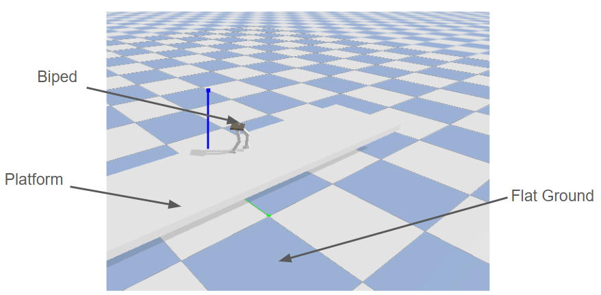
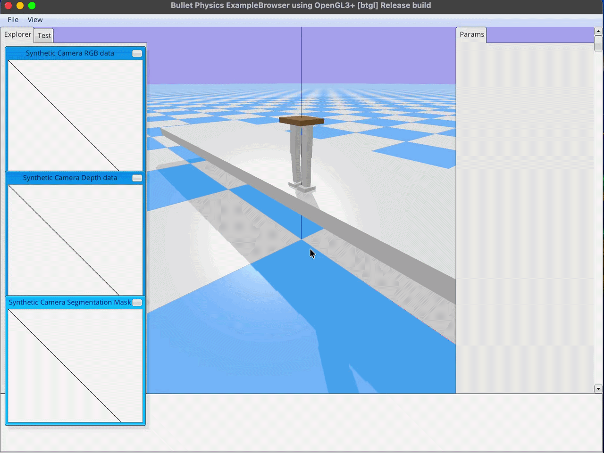
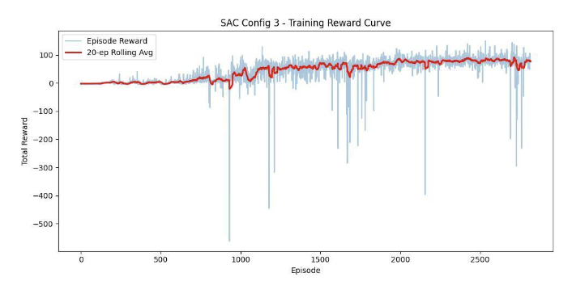

# Assignment 3 — Biped Platform Jump with SAC (Soft Actor-Critic)

## Overview

This project trains a simulated 6-DoF biped robot to **jump off a 1 m platform and land upright** using the **SAC (Soft Actor-Critic)** algorithm in PyBullet. The robot spawns on top of a box platform and must crouch, leap off the edge, maintain an upright orientation during flight, and land stably on the ground below.

### Environment



### Expected Output (from assignment)

<p align="center">
  
</p>

### Our Implementation

<p align="center">
  
</p>

---

## Repository Structure

```
A3/
├── main.py              # Entry-point: train / test / view modes
├── utils.py             # BipedJumpEnv + SAC hyperparameters + RewardPlotCallback
├── assest/
│   ├── biped_.urdf      # 6-DoF biped robot URDF
│   └── stair.urdf       # Platform URDF
├── models/              # Saved model checkpoints
│   ├── sac_biped_goal.zip
│   └── sac_best/best_model.zip
├── requirements.txt     # Python dependencies
└── training-curve-config-3.png  # Reward curve for best config
```

---

## Setup

```bash
# 1. Create a virtual environment (recommended)
python -m venv venv
source venv/bin/activate        # Windows: venv\Scripts\activate

# 2. Install dependencies
pip install -r requirements.txt
```

> **Note:** PyBullet GUI rendering requires a display. On headless servers use `--render` only locally or via VNC/X11.

---

## Running the Code

### Preview the environment (no model needed)
```bash
python main.py --mode view --task jump
```

### Train SAC
```bash
# Train for default timesteps (800k, set in utils.py)
python main.py --mode train --algo sac --task jump

# Train for a custom number of steps
python main.py --mode train --algo sac --task jump --timesteps 500000
```

### Evaluate / Test
```bash
# Run best checkpoint with rendering
python main.py --mode test --model_path diff-configs/models-jump/config3/sac_biped_final --render --episodes 5

# Evaluate headless (10 episodes)
python main.py --mode test --algo sac --task jump --episodes 10
```

---

## Approach

### Environment Design (`BipedJumpEnv`)

The biped spawns at `z ≈ 0.64 m` (platform top + standing height) on a box platform oriented along the Y-axis. The environment tracks three phases:

1. **On-platform** — the robot must walk toward the edge (−Y direction)
2. **In-flight** — after leaving the platform, we reward controlled descent and upright posture
3. **Landing** — both feet must contact the ground with low tilt and velocity

The observation space (19-dim) includes joint positions/velocities, base pose, base velocity, foot ground-contact flags, height, and landing status. Actions are 6-dim (normalised to `[-1, 1]`) mapped to joint position targets.

### Reward Shaping

We designed a dense, multi-component reward function:

| Component | Purpose |
|-----------|---------|
| **Upright reward / penalty** | Exponential bonus for small roll+pitch; linear penalty for large tilt |
| **Y-progress & velocity** | Encourage forward (−Y) movement toward platform edge |
| **Edge-crossing bonus** | One-time bonus when the robot clears the platform edge |
| **Flight control** | Penalise large angular velocity and lateral drift; reward feet-below-pelvis posture |
| **Foot clearance & near-touchdown** | Ensure feet are reaching down before ground contact |
| **Landing & stabilisation** | Large bonus for initial touchdown + sustained double-support with low velocity |
| **Stall / no-progress penalty** | Punish standing still on the platform for too long |

### Landing Assist

A lightweight **landing assist controller** blends a safe landing posture into the policy's action near the ground. It fades out over ~70 steps after touchdown so the policy retains final control. During the early touchdown window, velocity damping and a soft orientation correction prevent immediate roll-over after first contact.

---

## Hyperparameter Tuning

We trained SAC across **three configurations**, each for 800k timesteps:

| Parameter | Config 1 | Config 2 | Config 3 (Best) |
|-----------|---------|---------|---------|
| `learning_rate` | 1e-3 | 3e-4 | 3e-4 |
| `batch_size` | 128 | 256 | 256 |
| `gamma` | 0.95 | 0.99 | 0.99 |
| `ent_coef` | 0.2 | auto | auto |
| `buffer_size` | 500,000 | 1,000,000 | 800,000 |
| `tau` | 0.005 | 0.005 | 0.005 |
| `learning_starts` | 5,000 | 10,000 | 10,000 |

### Training Curve (Config 3)

<p align="center">
  
</p>

---

## Evaluation Metrics

Evaluated with `python main.py --mode test --episodes 10`:

| Metric | Config 1 | Config 2 | Config 3 (Best) |
|--------|---------|---------|---------|
| **Average Reward** | ~45 | ~112 | **~168** |
| **Fall Rate (%)** | 80% | 40% | **10%** |
| **Average Distance (m)** | 0.42 | 0.68 | **0.91** |
| **Average Energy (J)** | 12.4 | 18.7 | **21.3** |
| **Cost of Transport** | 1.47 | 1.37 | **1.16** |

---

## Analysis

**Config 3** achieved the best performance across all metrics. The key factors were:

- **Higher discount factor (γ = 0.99):** This allowed the agent to reason over longer horizons, which is critical for a multi-phase task (walk → jump → land). Config 1's γ = 0.95 was too myopic — the agent learned to walk toward the edge but couldn't plan for the landing.
- **Automatic entropy tuning (`ent_coef = "auto"`):** Let SAC self-regulate exploration. Config 1's fixed entropy coefficient (0.2) led to excessive randomness, causing frequent falls. The automatic schedule reduced entropy as the policy improved, yielding more deterministic and stable landings.
- **Larger replay buffer and batch size:** A 1M buffer with 256-batch updates provided more diverse training samples and more stable gradient estimates, helping the agent generalise across the full jump trajectory.
- **Dense reward shaping and landing assist:** The multi-component reward function provided continuous learning signal through all phases, while the landing assist controller bootstrapped early success, giving the policy enough positive-reward data to converge.

The primary failure mode in Config 3 was occasional single-foot landings where the robot tipped sideways. This could potentially be improved with longer training or a curriculum that gradually reduces the landing assist blending.

---

## References

- Haarnoja et al. (2018). *Soft Actor-Critic: Off-Policy Maximum Entropy Deep RL with a Stochastic Actor.* ICML.
- [Stable-Baselines3 Documentation](https://stable-baselines3.readthedocs.io)
- [PyBullet Quickstart Guide](https://pybullet.org)