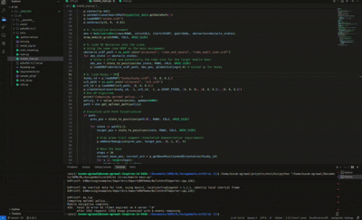

# Reinforcement Learning - Assignments

Course assignments for Semester 6 RL for Robotics. Each assignment has its own folder with detailed instructions and running commands.

---

## Assignment 1: Grid Navigation using Dynamic Programming

### Team
1. [Akshat Jha](https://github.com/AkshatJha0411)
2. [Kusum Agrawal](https://github.com/AgrawalKusum)

### Demo of Husky:

  

Implements **Policy Iteration** and **Value Iteration** for robotic path planning. A UR5 robotic manipulator navigates on a grid world with obstacles. Uses PyBullet for 3D visualization. Includes main simulation, unseen environment tests, and extra credits (mobile base with Husky + mounted UR5).

*See [A1/README.md](A1/README.md) for details of Assignment 1 and it's installation and running instructions.*

---

## Assignment 2

*To be added when done.*

---

## Assignment 3

*To be added when done.*
