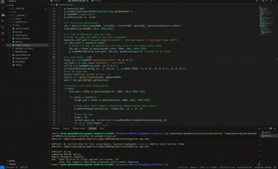

# Reinforcement Learning - Assignments

Course assignments for Semester 6 RL for Robotics. Each assignment has its own folder with detailed instructions and running commands.

---

## Assignment 1: Grid Navigation using Dynamic Programming

### Team
1. [Akshat Jha](https://github.com/AkshatJha0411)
2. [Kusum Agrawal](https://github.com/AgrawalKusum)

### Demo of Husky:

  

Implements **Policy Iteration** and **Value Iteration** for robotic path planning. A UR5 robotic manipulator navigates on a grid world with obstacles. Uses PyBullet for 3D visualization. Includes main simulation, unseen environment tests, and extra credits (mobile base with Husky + mounted UR5).

*See [A1/README.md](A1/README.md) for details of Assignment 1 and it's installation and running instructions.*

---

## Assignment 2: Drone Hovering using Model-Free Control

### Team
1. [Akshat Jha](https://github.com/AkshatJha0411)
2. [Kusum Agrawal](https://github.com/AgrawalKusum)

  

Implements **Monte Carlo Control** and **Q-Learning (TD)** to teach a simulated drone to hover at a fixed 3D target position using the `gym-pybullet-drones` HoverAviary environment. The continuous position state is discretized into a 10-bin-per-axis Q-table, and a 1D thrust action space (`-1`, `0`, `+1`) is used. Also includes three bonus challenges — **SARSA**, **Double Q-Learning**, and **Experience Replay** — all of which were completed for full bonus credit.

**Final Score: 85 / 85 + 20 / 20 bonus points**

*See [A2/README.md](A2/README.md) for implementation details, results, and running instructions.*

---

## Assignment 3

*To be added when done.*
